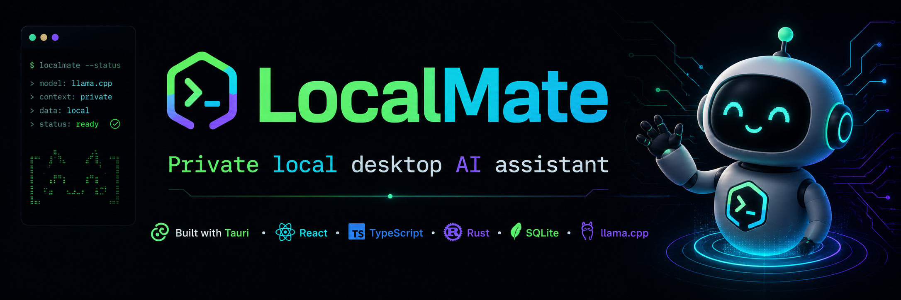
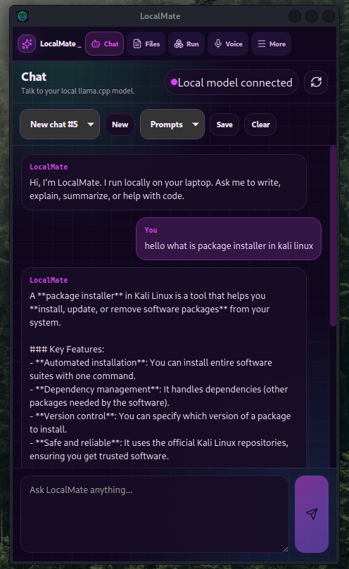
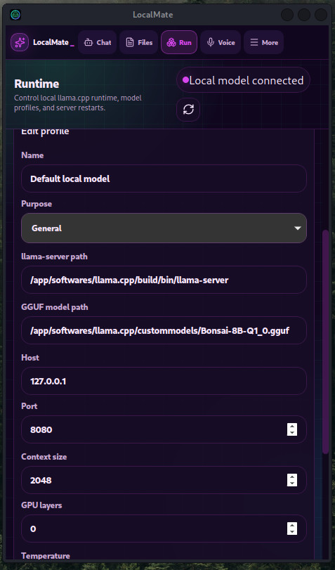
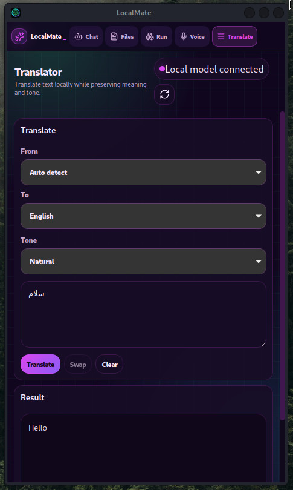
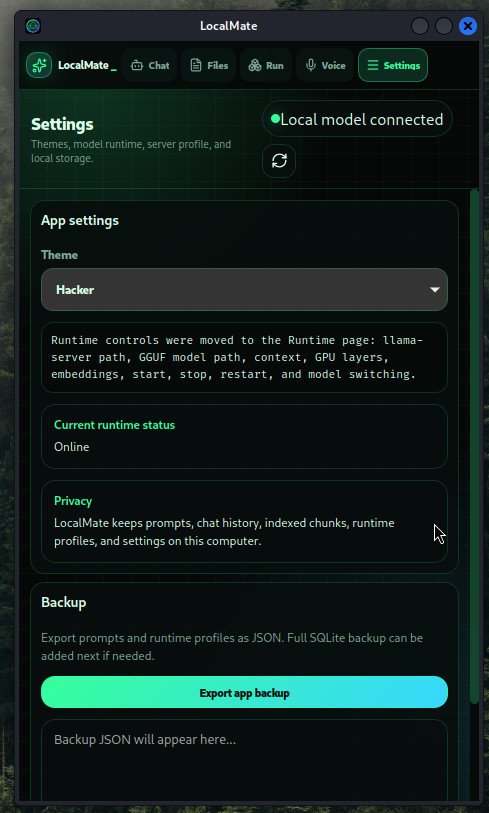
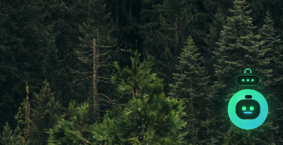

<p align="center">
  
</p>

<h1 align="center">LocalMate</h1>

<p align="center">
  <strong>Private local desktop AI assistant powered by llama.cpp</strong>
</p>

<p align="center">
  <a href="https://github.com/khashino/localmate/releases">Download Release</a>
  ·
  <a href="#build-from-source">Build From Source</a>
  ·
  <a href="#screenshots">Screenshots</a>
</p>

---

## About

**LocalMate** is a compact desktop AI assistant built with **Tauri**, **React**, **TypeScript**, **Rust**, **SQLite**, and **llama.cpp**.

It runs locally on your laptop and connects to your own `llama-server`, so your chats, prompts, files, runtime profiles, and notes stay on your machine.

## Features

- Local AI chat with your own GGUF model
- Runtime profiles for different llama.cpp models
- Start, stop, and restart `llama-server` from the app
- PDF, DOCX, text, code, and folder indexing
- Folder Q&A with citations
- Semantic search support when embeddings are enabled
- Local translator
- Prompt Manager with import/export
- Native Linux voice recorder using `arecord`
- Voice note cleanup, summaries, and action items
- Floating draggable assistant bubble
- Theme selection
- Local backup export

## Screenshots

### Chat

<p align="center">
  
</p>

### Runtime Profiles

<p align="center">
  
</p>

### Translator

<p align="center">
  
</p>

### Settings

<p align="center">
  
</p>

### Floating Bubble

<p align="center">
  
</p>

## Download

The first Linux release is available from GitHub Releases:

```text
https://github.com/khashino/localmate/releases
```

Download one of:

- `.AppImage` for portable Linux use
- `.deb` for Debian, Ubuntu, Kali, Linux Mint
- `.rpm` for Fedora/RHEL-based systems

## Install on Linux

### AppImage

```bash
chmod +x LocalMate_0.1.0_amd64.AppImage
./LocalMate_0.1.0_amd64.AppImage
```

### Debian / Ubuntu / Kali

```bash
sudo apt install ./LocalMate_0.1.0_amd64.deb
localmate
```

### Fedora / RPM

```bash
sudo rpm -i LocalMate-0.1.0-1.x86_64.rpm
localmate
```

## Requirements

You need:

- Linux desktop
- `llama.cpp`
- a `.gguf` model
- Node.js and Rust only if building from source

For native voice recording:

```bash
sudo apt install alsa-utils
```

## llama.cpp Example

```bash
/path/to/llama.cpp/build/bin/llama-server \
  -m /path/to/model.gguf \
  -c 2048 \
  -ngl 0 \
  --host 127.0.0.1 \
  --port 8080
```

LocalMate can also start this from the **Runtime** page after you set the server path and model path.

## First Setup

1. Open LocalMate.
2. Go to **Runtime**.
3. Create or edit a runtime profile.
4. Set:
   - `llama-server` path
   - GGUF model path
   - host
   - port
   - context size
   - GPU layers
   - embeddings on/off
5. Click **Save profile**.
6. Click **Activate + restart**.
7. Start using Chat, Files, Translator, Prompts, or Voice.

## Build From Source

```bash
git clone https://github.com/khashino/localmate.git
cd localmate
npm install
npm run tauri dev
```

Build Linux installers:

```bash
npm run tauri build
```

Build output:

```text
src-tauri/target/release/bundle
```

## Assets Used by README

This README expects these files:

```text
assets/localmate_ai_assistant_banner.png
assets/screenshot1.jpg
assets/screenshot2.jpg
assets/screenshot3.jpg
assets/screenshot4.jpg
assets/screenshot5.jpg
```

## Privacy

LocalMate is local-first.

Your chats, prompts, indexed file chunks, runtime profiles, recordings, and settings stay on your computer.

LocalMate does not include a model file. You choose and run your own GGUF model locally.

## Notes

- Large `.gguf` model files are not included.
- Release installers are not stored in Git history.
- Download installers from GitHub Releases.
- Windows installer support is planned through GitHub Actions.
- Automatic voice transcription is not included yet.

## License

MIT
